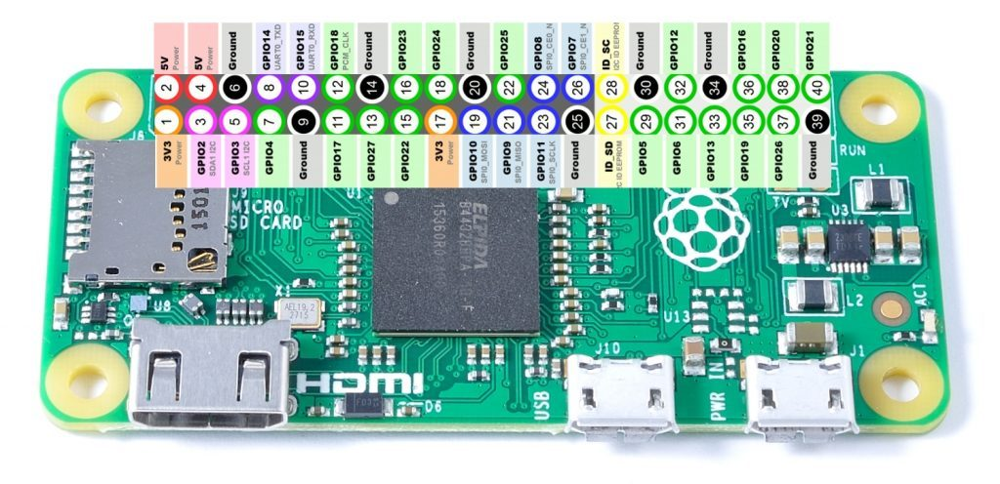

# picode - All code that is run on the Saufhaengerle Raspberry Pi


* [picode - All code that is run on the Saufhaengerle Raspberry Pi](#picode---all-code-that-is-run-on-the-saufhaengerle-raspberry-pi)
  * [Links](#links)
  * [TODO](#todo)
  * [Contents](#contents)
    * [switcher](#switcher)
    * [zapfhahn](#zapfhahn)
  * [Timezone notes](#timezone-notes)
  * [Install pyfingerprint](#install-pyfingerprint)
    * [pyfingerprint - required modifications / hacks](#pyfingerprint---required-modifications--hacks)
  * [Fixing the image download from charBuffer](#fixing-the-image-download-from-charbuffer)
    * [Using fingerprint sensor](#using-fingerprint-sensor)
  * [Valve notes](#valve-notes)
  * [MariaDB notes](#mariadb-notes)
    * [phpMyAdmin](#phpmyadmin)
    * [Grafana](#grafana)

## Links

* saufanlage myPhpAdmin: http://saufanlage.local:81/http://saufanlage.local:81/phpmyadmin/
  * suffi - NU-AD-76
* saufanlage grafana: http://saufanlage.local:3000
  * admin - NU-AD-76

## TODO

* Multiple fingers per user
  * Fingerprint class?
* Only valves that are registered for user
* Auto-close when idle, i.e. no quantity for x seconds
* Logs to website
* Web terminal
* Android app with push notifications
  * some statistics for every tap
* Web interface for valve/daemon configuration
* Web interface to start calib?
* Warning when tapped quantity threshold is reached
* 4 digit display


Code here is set up for python version 3.X and all required packages are defined in `requirements.txt`.

To set up the RPi do

```bash
# first make sure you installed python3.X + some dev libs
sudo apt-get install python3 python3-dev libtiff5-dev zlib1g-dev libfreetype6-dev liblcms2-dev libwebp-dev libharfbuzz-dev libfribidi-dev tcl8.6-dev tk8.6-dev python-tk git python3-venv emacs devscripts equivs libjpeg-dev apt-get install python3-dev
```

(most of the requirements are for `Pillow` which is required by pyfingerprint)

Now set up the virtual environment

```bash
git clone --recursive https://gitlab.com/saufhaengerle/picode
cd picode
python3.7 -m venv venv
source venv/bin/activate
pip install -r requirements.txt
```

If you want to set up the repository for development, **additional steps** are required. After completing the steps above do

```bash
pre-commit install
```

## Contents

### switcher

A webapp that can switch attached relays. Usually used for switching lights.

Notes:

* Bootstrap version 2.3.2
* Bootstrap toggle from http://www.bootstraptoggle.com/

### zapfhahn

All the code that is required to run the Zapfhahn.

## Timezone notes

Make sure that you select the correct timezone!

```bash
$ sudo raspi-config
# select Europe/Berlin in option '4. Localisation options'
```

## Install pyfingerprint

```bash
# dirty hack because pip install does not actually install the package, only sets the context
mkdir venv/lib/python3.5/site-packages/pyfingerprint
cp src/zapfhahn/hardware/pyfingerprint/src/files/pyfingerprint/pyfingerprint.py venv/lib/python3.5/site-packages/pyfingerprint
```

In order to use the Raspberry Pi's serial port I had to make change that is explained [here](https://raspberrypi.stackexchange.com/questions/45570/how-do-i-make-serial-work-on-the-raspberry-pi3-pi3b-pizerow/45571#45571). More informatio$

Do

```bash
sudo emacs -nw /boot/config.txt
```

and add the lines

```
enable_uart=1
dtoverlay=pi3-disable-bt
```

Further /boot/cmdline.txt needs some editing to prevent the console from using the UART

```bash
sudo emacs -nw /boot/cmdline.txt
```

and remove the following entry

```
console=serial0,115200
```


It is also necessary to disable the system service that initialises the modem so it doesn't use the UART: `sudo systemctl disable hciuart`.

After rebooting, this will make the uart pins available as `/dev/ttyAMA0` or better `/dev/serial0`.

To install minicom use

```bash
$ sudo apt-get install minicom
```

Now you can test the serial port, shortcut TX and RX on the pi and run the following code

```bash
$ sudo minicom -b 57600 -o -D /dev/serial0
```

If everything is working correctly the terminal will echo every keystroke.

### pyfingerprint - required modifications / hacks

We've tried many libraries and the different notes a bit spread over multiple READMEs.
Now we are using the pyfingerprint library directly in python and the notes about the wiring are in the [FPM-pi README](https://gitlab.com/saufhaengerle/picode/blob/master/src/zapfhahn/hardware/FPM-pi/README.md)

There is a special feature about the R551 sensor that needs a slight modification in the pyfingerprint library.
It is discussed in [this thread](https://github.com/brianrho/FPM/issues/8) and the fix for python is inspired by [these lines](if (page == 0 && group_idx == 0 && fid == 0)).

The point is that when scanning the page IDs for some reason the first bit in the first pageElement is always `False`.
This makes the library think that ID#0 is free, always.
For that reason the first entry must be skipped.
Specifically, this means replacing these lines

```python
# in pyfingerprint.py - function is getTemplateIndex(self, page)
for pageElement in pageElements:
    ## Test every bit (bit = template position is used indicator) of a table page element
    for p in range(0, 7 + 1):
        positionIsUsed = (self.__bitAtPosition(pageElement, p) == 1)
        templateIndex.append(positionIsUsed)
```

with

```python
for idx, pageElement in enumerate(pageElements):
    ## Test every bit (bit = template position is used indicator) of a table page element
    for p in range(0, 7 + 1):
        if idx == 0 and p == 0: continue
        positionIsUsed = (self.__bitAtPosition(pageElement, p) == 1)
        templateIndex.append(positionIsUsed)
```

## Fixing the image download from charBuffer

In the `loadTemplate` method something goes wrong.
We have to replace

```python
        packetPayload = (
            FINGERPRINT_LOADTEMPLATE,
            charBufferNumber,
            self.__rightShift(positionNumber, 8),
            self.__rightShift(positionNumber, 0),
        )
```

with

```python
        packetPayload = (
            FINGERPRINT_LOADTEMPLATE,
            charBufferNumber,
            self.__rightShift(positionNumber, 8),
            self.__rightShift(positionNumber, 0) & 0xFF,
        )
```

i.e., we have to add the `& 0xFF` part.

### Using fingerprint sensor

We use the [WiringPi](http://wiringpi.com/download-and-install/) library to provide the external functions.

**WiringPi is pre-installed on raspian!**

This code was developed using

```bash
pi@octopi:~/saufhaengerle/picode/src/zapfhahn/hardware/FPM-C $ gpio -v
gpio version: 2.46
Copyright (c) 2012-2018 Gordon Henderson
This is free software with ABSOLUTELY NO WARRANTY.
For details type: gpio -warranty

Raspberry Pi Details:
  Type: Pi 3, Revision: 02, Memory: 1024MB, Maker: Sony
  * Device tree is enabled.
  *--> Raspberry Pi 3 Model B Rev 1.2
  * This Raspberry Pi supports user-level GPIO access.
```

In order to use the Raspberry Pi's serial port I had to make change that is explained [here](https://raspberrypi.stackexchange.com/questions/45570/how-do-i-make-serial-work-on-the-raspberry-pi3-pi3b-pizerow/45571#45571). More information can also be found [here](https://www.raspberrypi.org/documentation/configuration/uart.md)

Do

```bash
sudo emacs -nw /boot/config.txt
```

and add the lines

```
enable_uart=1
dtoverlay=pi3-disable-bt
```

Further /boot/cmdline.txt needs some editing to prevent the console from using the UART

```bash
sudo emacs -nw /boot/cmdline.txt
```

and remove the following entry

```
console=serial0,115200
```

It is also necessary to disable the system service that initialises the modem so it doesn't use the UART: `sudo systemctl disable hciuart`.

After rebooting, this will make the uart pins available as `/dev/ttyAMA0` or better `/dev/serial0`.

The code can be compiled using

 ```bash
 gcc -lwiringPi -o test fpm_raspi.c
 ```


 #### Wiring

The picture shows how the sensor was connected to the RPi.


It is installed according to the manual, with pins 1 and 7 left disconnected.
Only the UART, 3.3V and GND pins are connected.


The pins on the RPi 3 Model B are labeled like this


The pins on the Raspberry Pi Zero are labeled like this



We have these connections

| Sensor pin | Sensor cable color | RPi pin       | RPi color     | Comment           |
|------------|--------------------|---------------|---------------|-------------------|
| 1          | orange             | not connected |               |                   |
| 2          | white              | 3.3V/01       | black         |                   |
| 3          | blue               | GPIO15 TX/10  | orange/purple | RPi TX->Sensor RX |
| 4          | green              | GPIO14 RX/08  | yellow/blue   | RPi RX->Sensor TX |
| 5          | yellow             | GND           | green         |                   |
| 6          | black              | 3.3V/17       | yellow        |                   |
| 7          | red                | not connected |               |                   |

## Valve notes

The valves run on 12V DC power.
The polarity does not matter.
We connect them to a relay that controls their state.
In my test setup I connected them to the normally open (NO) port.
That is because the data pin is usually in HIGH mode and we have to explicitly pull it down.
Like this, the current draw is 0 until we open it with `valve.open()`.
The logic side of the 5V relay was connected GND, Vcc = 5V and the data pin was connected to the raspberry pi **using a logic level converter**.

## MariaDB notes

```bash
sudo apt-get install mariadb-server
```

Then run the setup script

```bash
$ sudo mysql_secure_installation

NOTE: RUNNING ALL PARTS OF THIS SCRIPT IS RECOMMENDED FOR ALL MariaDB
      SERVERS IN PRODUCTION USE!  PLEASE READ EACH STEP CAREFULLY!

In order to log into MariaDB to secure it, we'll need the current
password for the root user.  If you've just installed MariaDB, and
you haven't set the root password yet, the password will be blank,
so you should just press enter here.

Enter current password for root (enter for none):
OK, successfully used password, moving on...

Setting the root password ensures that nobody can log into the MariaDB
root user without the proper authorisation.

You already have a root password set, so you can safely answer 'n'.

Change the root password? [Y/n] n
 ... skipping.

By default, a MariaDB installation has an anonymous user, allowing anyone
to log into MariaDB without having to have a user account created for
them.  This is intended only for testing, and to make the installation
go a bit smoother.  You should remove them before moving into a
production environment.

Remove anonymous users? [Y/n] n
 ... skipping.

Normally, root should only be allowed to connect from 'localhost'.  This
ensures that someone cannot guess at the root password from the network.

Disallow root login remotely? [Y/n] Y
 ... Success!

By default, MariaDB comes with a database named 'test' that anyone can
access.  This is also intended only for testing, and should be removed
before moving into a production environment.

Remove test database and access to it? [Y/n] Y
 - Dropping test database...
 ... Success!
 - Removing privileges on test database...
 ... Success!

Reloading the privilege tables will ensure that all changes made so far
will take effect immediately.

Reload privilege tables now? [Y/n] Y
 ... Success!

Cleaning up...

All done!  If you've completed all of the above steps, your MariaDB
installation should now be secure.

Thanks for using MariaDB!
```

Create a user with privileges that is allowed to connect from subnet

```
$ sudo mysql -u root
Welcome to the MariaDB monitor.  Commands end with ; or \g.
Your MariaDB connection id is 9
Server version: 10.1.38-MariaDB-0+deb9u1 Raspbian 9.0

Copyright (c) 2000, 2018, Oracle, MariaDB Corporation Ab and others.

Type 'help;' or '\h' for help. Type '\c' to clear the current input statement.

MariaDB [(none)]> GRANT ALL PRIVILEGES ON *.* TO 'suffi'@'localhost' IDENTIFIED BY 'NU-AD-76';
Query OK, 0 rows affected (0.00 sec)
```

We also add a read-only user for grafana

```bash
GRANT SELECT,SHOW VIEW ON *.* TO 'grafana'@'localhost' IDENTIFIED BY 'grafana_view_user';
```

#### Backing up the DB

Export it using

```bash
$ mysqldump -u suffi -p SaufDatabase > SaufDatabase.sql.bak
```

Import it with

```bash
# only necessary if the DB doesn't already exist
$ mysql -u suffi -p
CREATE DATABASE SaufDatabase;
```

and

```bash
mysql -u suffi -p SaufDatabase < SaufDatabase.sql.bak
```


### phpMyAdmin

```bash
sudo apt-get install phpmyadmin
# note: select apache2 if asked
# select yes when asked if you want to generate a DB
# provide password (recommended NU-AD-76)
```

Add phpmyadmin apache conf

```bash
$ sudo emacs -nw /etc/apache2/apache2.conf
# at bottom insert
Include /etc/phpmyadmin/apache.conf
# restart apache
$ sudo /etc/init.d/apache2 restart
```

If you want to make the server listen to a different port edit

```bash
$ sudo emacs -nw /etc/apache2/apache2.conf
$ sudo /etc/init.d/apache2 restart
```

Link the phpMyAdmin landing page

```bash
sudo ln -s /usr/share/phpmyadmin /var/www/html
```

Now you can connect to it, e.g. on `http://192.168.178.86:81/phpmyadmin`

### Grafana

```bash
$ wget https://dl.grafana.com/oss/release/grafana-rpi_6.2.1_armhf.deb
$ sudo dpkg -i grafana-rpi_6.2.1_armhf.deb
```

Add grafana to autostart

```bash
$ sudo /bin/systemctl daemon-reload
$ sudo /bin/systemctl enable grafana-server
```

The grafana server is listening on port 3000.
Log in on `http://192.168.178.86:3000` using user admin with password admin.
Grafana will ask you to change the PW after your first login.
Of course we change it to NU-AD-76.

There we can add a database

* Type: MySQL
* Host: localhost:3306
* Database: SaufDatabase
* User: grafana
* Password: grafana_view_user