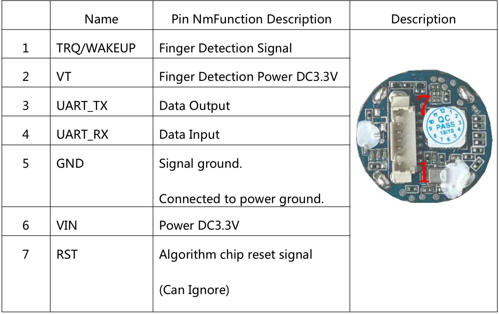

## ahoenle:

Original README below, this was added by ahoenle on 2019-04-19.

We use the [WiringPi](http://wiringpi.com/download-and-install/) library to provide the external functions.

**WiringPi is pre-installed on raspian!**

This code was developed using

```bash
pi@octopi:~/saufhaengerle/picode/src/zapfhahn/hardware/FPM-C $ gpio -v
gpio version: 2.46
Copyright (c) 2012-2018 Gordon Henderson
This is free software with ABSOLUTELY NO WARRANTY.
For details type: gpio -warranty

Raspberry Pi Details:
  Type: Pi 3, Revision: 02, Memory: 1024MB, Maker: Sony
  * Device tree is enabled.
  *--> Raspberry Pi 3 Model B Rev 1.2
  * This Raspberry Pi supports user-level GPIO access.
```

In order to use the Raspberry Pi's serial port I had to make change that is explained [here](https://raspberrypi.stackexchange.com/questions/45570/how-do-i-make-serial-work-on-the-raspberry-pi3-pi3b-pizerow/45571#45571). More information can also be found [here](https://www.raspberrypi.org/documentation/configuration/uart.md)

Do

```bash
sudo emacs -nw /boot/config.txt
```

and add the lines

```
enable_uart=1
dtoverlay=pi3-disable-bt
```
It is also necessary to disable the system service that initialises the modem so it doesn't use the UART: `sudo systemctl disable hciuart`.

After rebooting, this will make the uart pins available as `/dev/ttyS0`.

The code can be compiled using

 ```bash
 gcc -lwiringPi -o test fpm_raspi.c
 ```


 ## Wiring

The picture shows how the sensor was connected to the RPi.


It is installed according to the manual, with pins 1 and 7 left disconnected.
Only the UART, 3.3V and GND pins are connected.



The pins on the RPi are labeled like this


We have these connections

| Sensor pin | Sensor cable color | RPi pin       | RPi color     | Comment           |
|------------|--------------------|---------------|---------------|-------------------|
| 1          | orange             | not connected |               |                   |
| 2          | white              | 3.3V/01       | black         |                   |
| 3          | blue               | GPIO14 TX/08  | orange/purple | RPi TX->Sensor TX |
| 4          | green              | GPIO15 RX/08  | yellow/blue   | RPi RX->Sensor RX |
| 5          | yellow             | GND           | green         |                   |
| 6          | black              | 3.3V/17       | yellow        |                   |
| 7          | red                | not connected |               |                   |


_Here begins the original README:_

## Generic C library for R3xx/ZFMxx/FPMxx/R551 fingerprint modules

To use it, the following interface needs to be provided to the library, which expects function pointers with these prototypes:

    /* to get the millisecond count since reset */
    uint32_t (*fpm_millis_func)(void);

    /* millisecond delays */
    void (*fpm_delay_func)(uint32_t interval);

    /* to read from the UART port connected to the module */
    uint16_t (*fpm_uart_read_func)(uint8_t * bytes, uint16_t len);

    /* to write to the UART port connected to the module */
    void (*fpm_uart_write_func)(uint8_t * bytes, uint16_t len);

    /* to get the current number of available bytes to be read */
    uint16_t (*fpm_uart_avail_func)(void);

Check out the examples for details.
